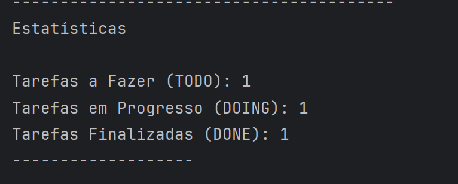

# TODO List


## Conteúdos:

- [Introdução](#introdução)
- [Frontend](#frontend)
  - [Criar Tarefa](#criar-tarefa)
  - [Filtragem de Tarefas](#filtrar-tarefas)
  - [Deletar e Editar Tarefa](#deletar-e-editar-tarefa)
- [Backend](#backend)
  - [Executando o Sistema](#executando-o-sistema)
  - [Utilizando o Sistema](#utilizando-o-sistema)
    - [Criando uma Tarefa](#criando-uma-tarefa)
    - [Listando as Tarefas](#listando-as-tarefas)
    - [Atualizando uma Tarefa](#atualizando-a-tarefa)
    - [Deletando uma Tarefa](#deletando-uma-tarefa)
    - [Estatísticas](#estatísticas)

## Introdução
Este projeto é uma releitura do clássico Todo List, desenvolvido utilizando Java para o backend e vanilla Js para no frontend.

## Frontend

A todo list ganhou uma nova cara!

Estamos no meio de um processo de evolução. A todo list agora possui interface gráfica!
Embora ainda não seja possível salvar as suas tarefas, já é possível usufruir de uma interface linda e amigável.

Ainda estamos em processo inicial de transformação deste projeto, algumas das melhorias futuras são:
* Permitir salvar as tarefas no localstorage;
* Comunicação com o backend;
* Adicionar responsividade para permitir a visualização das tarefas em dispositivos menores.


### Criar Tarefa

Para criar uma nova tarefa utilize o formulário que se encontra à direita da página.

Todas os campos são necessários para permitir a criação de uma nova tarefa.

Ao adicionar um novo 'todo', se você utilizar uma categoria que ainda não existe, essa categoria será criar irá aparecer no menu
'Categorias'. Se essa categoria já existir, você perceberá que o número ao lado desta categoria irá ser acrescido de 1.

Não é necessário deletar categorias. Quando uma categoria não tiver nenhuma tarefa associada a ela, ela será automaticamente deletada.

### Filtrar Tarefas

As tarefas são listadas por padrão seguindo a seguinte regra:

1. Tarefas com prioridade maior são exibidas primeiro;
2. Tarefas com a mesma prioridade são ordenadas pela sua data (datas mais próximas aparecem primeiro).

Através dos menus da esquerda é possível também filtrar as suas tarefas por:
  * Categoria;
  * Nível de Prioridade;
  * Status;

Se você deseja visualizar todas as tarefas basta clicar em "mostrar todas tarefas".

### Deletar e Editar Tarefa

Ao clicar no card de uma tarefa, as informações dessa tarefa serão transpostas para o formulário e este irá entrar no modo 'edição'.
Você pode confirmar isso ao se atentar a três itens:
1. O nome do formulário muda de "Adicionar Todo" para "Editando Todo";
2. Um novo botão ("Deletar") pode ser visualizado;
3. O botão de "Salvar" agora possui o texto "Editar".

Ao alterar os itens de uma tarefa e clicar em "Editar" essa tarefa será atualizada!
Se você clicar em cancelar, nada será feito e o formulário irá retornar ao seu padrão ("Adicionar Tarefa")
Por fim, se você clicar em "Deletar" a tarefa será deletada.

## Backend

## Executando o Sistema

Para executar este sistema você deve ter o Java instalado na sua máquina, ou abri-lo utilizando uma IDE com o JVM integrado.

Para maiores informações visite [o site oficial Java](https://www.java.com/en/).

Com um terminal aberto no local que você deseja salvar este projeto, clone este repositório utilizando o comando

````
git clone https://github.com/ajhopf/ACZG-todo.git
````

Assim como a maior parte dos sistemas Java, a "porta de entrada" do sistema é através do método main da classe Main.


Visando facilitar o teste do programa, já existe um arquivo chamado 'tarefas.txt' na pasta raíz do projeto. Neste arquivo encontram-se 4
tarefas já cadastradas. Elas serão carregadas automáticamente ao iniciar o sitema, com mensagens informativas para um carregamento de sucesso.

Se você deseja iniciar o sistema sem nenhuma tarefa cadastrada simplesmente delete este arquivo.

O único código realmente necessário da classe Main é:

Para iniciar o sistema, execute o método main.

## Utilizando o Sistema

A navegação do sitema é feita através dos números das opções que são mostradas em cada menu.


Não é possível criar diretamente uma categoria. Categorias são criadas automaticamente quando inserimos novas tarefas no sistema com uma categoria atrelada que ainda não existe.

É possível fazer a edição de todos os campos de uma tarefa, menos o seu identificador.

### Criando uma Tarefa

Para criar uma nova tarefa devemos selecionar a opção 2 do menu inicial.
Uma tarefa tem, obrigatoriamente, os seguintes campos:
* Nome;
* Descrição;
* Data de Término -> deverá ser inserida uma data válida no formato dd/MM/yyyy
* Nível de Prioridade, onde:
  * 1 - Muito Baixo
  * 2 - Baixo
  * 3 - Médio
  * 4 - Alto
  * 5 - Muito Alto
* Categoria -> irá criar automaticamente uma categoria quando ela não existir
* Status, sendo possível os seguintes valores:
  * TODO
  * DOING
  * DONE

### Listando as Tarefas

As tarefas são sempre listadas de forma que as tarefas com maior prioridade aparecem no topo da lista.

Além disso são fornecidas diversas opções de listagem como:


* Escolha de data:
  * Na opção 1 - Listar Todas Tarefas - é possível escolher filtrar as tarefas com base na data de término;
  * São fornecidas duas opções de filtragem:
    * Filtrar tarefas que tenham data de términa exata - irá mostrar apenas as tarefas que tem data de término igual a data escolhida para filtragem;
    * Filtrar tarefas que tenham data de término posterior a data fornecida.
* Filtrar tarefas por Prioridade:
  * Você poderá escolher qual nível de prioridade deseja ver e apenas as tarefas com este nível de prioridade serão listadas;
* Filtrar por Status:
  * Lista apenas as tarefas com o status selecionado;
* Filtrar por Categoria:
    * Lista apenas as tarefas com a categoria selecionada;

### Atualizando a Tarefa

Através da opção 3 do menu inicial você poderá selecionar uma tarefa para atualizá-la.

Ao entrar neste menu, todas as tarefas serão listadas, assim como o seu ID. Selecione o ID da tarefa para entrar no modo de edição.

A tarefa será impressa no terminal, então você poderá ter certeza de que selecionou a tarefa correta para editar.

Uma vez selecionada a tarefa, basta selecionar o campo que você deseja editar e, por fim, digitar o valor que deverá substituir o valor anterior.

### Deletando uma Tarefa

Através da opção 4 do menu inicial você poderá selecionar uma tarefa para deletá-la.

Ao entrar neste menu, todas as tarefas serão listadas, assim como o seu ID. Selecione o ID da tarefa para deletá-la.

Uma mensagem de sucesso informará que a tarefa foi deletada com sucesso.

### Deletando uma Categoria

Através da opção 5 do menu inicial você poderá selecionar uma categoria para deletá-la.

Ao entrar neste menu, todas as categorias serão listadas, assim como o seu ID. Selecione o ID da categoria para deletá-la.

ATENÇÃO! Você só poderá deletar uma categoria se nenhuma tarefa estiver atualmente atrelada a esta categoria.

Caso você tente deletar uma categoria que tenha uma tarefa, uma mensagem informativa será impressa no monitor e a deleção não ocorrerá.
Você deverá editar a tarefa, trocando a sua categoria para então deletar a categoria.

Quando for possível deletar uma categoria, uma mensagem de sucesso será impressa na tela.

### Estatísticas

Por fim, através da opção 6  do menu inicial você poderá ver uma estatística de quantas tarefas existem atualmente cadastradas para cada status possível (TODO, DOING e DONE).

